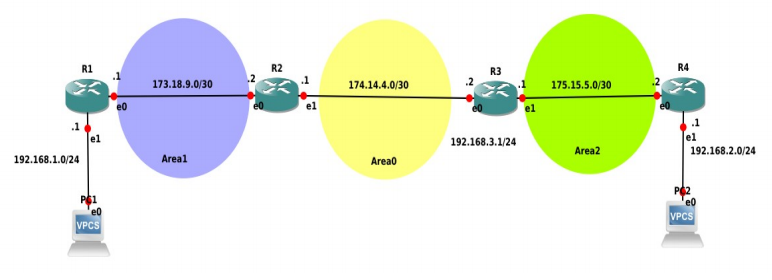
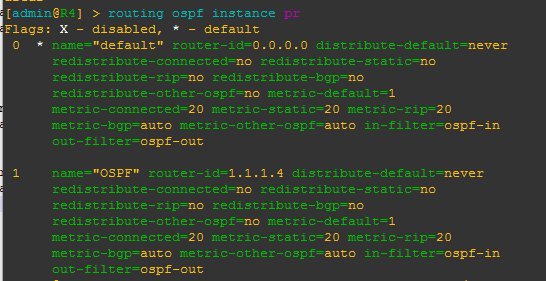
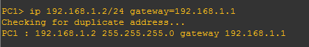
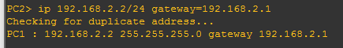
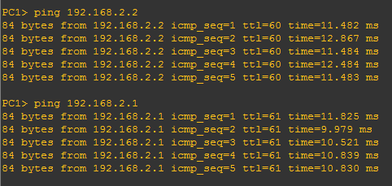

# OSPF Multi Area

# R1
~~~bash
ip address add address=173.18.9.1/30 interface=ether1
ip address add address=192.168.1.1/24 interface=ether2
interface bridge add name=loopback
ip address add address=1.1.1.1/32 interface=loopback
~~~

# R2
~~~bash
ip address add address=173.18.9.2/30 interface=ether1
ip address add address=174.14.4.1/30 interface=ether2
interface bridge add name=loopback
ip address add address=1.1.1.2/32 interface=loopback
~~~

# R3
~~~bash
ip address add address= 174.14.4.2/30 interface=ether1
ip address add address=175.15.5.1/30 interface=ether2
ip address add address=192.168.3.1/24 interface=ether3
interface bridge add name=loopback
ip address add address=1.1.1.3/32 interface=loopback
~~~

# R4
~~~bash
ip address add address= 175.15.5.2/30 interface=ether1
ip address add address= 192.168.2.1/24 interface=ether2
interface bridge add name=loopback
ip address add address=1.1.1.4/32 interface=loopback
~~~

## Konfigurasi OSPF 

terdapat 3 hal yang perlu di konfigurasi oleh OSPF :
* Mengaktifkan OSPF instance
* Konfigurasi OSPF Area
* Konfigurasi OSPF Network

# Berikut konfigurasi OSPF instance, OSPF Area, dan Network

# R1
~~~bash
routing ospf instance add name=OSPF router-id=1.1.1.1
routing ospf area add instance=OSPF area-id=0.0.0.1 name=area1
routing ospf network add network=173.18.9.0/30 area=area1
routing ospf network add network=192.168.1.0/24 area=area1
routing ospf instance set 1 redistribute-connected=as-type-1
~~~

# R2
~~~bash
routing ospf instance add name=OSPF router-id=1.1.1.2
routing ospf area add instance=OSPF area-id=0.0.0.0 name=area0
routing ospf area add instance=OSPF area-id=0.0.0.1 name=area1
routing ospf network add network=173.18.9.0/30 area=area1
routing ospf network add network=174.14.4.0/30 area=area0
routing ospf instance set 1 redistribute-connected=as-type-1
~~~

# R3
~~~bash
routing ospf instance add name=OSPF router-id=1.1.1.3
routing ospf area add instance=OSPF area-id=0.0.0.0 name=area0
routing ospf area add instance=OSPF area-id=0.0.0.2 name=area2
routing ospf network add network=174.14.4.0/30 area=area0
routing ospf network add network=175.15.5.0/30 area=area2
routing ospf instance set 1 redistribute-connected=as-type-1

~~~

# R4
~~~bash
routing ospf instance add name=OSPF router-id=1.1.1.4
routing ospf area add instance=OSPF area-id=0.0.0.2 name=area2
routing ospf network add network=192.168.2.0/24 area=area2
routing ospf network add network=175.15.5.0/30 area=area2
~~~

Untuk melihat informasi OSPF instance gunakan perintah:
*routing ospf instance print*

# PC1

# PC2

## Lakukan ping antar PC

## PC1 ke PC2

